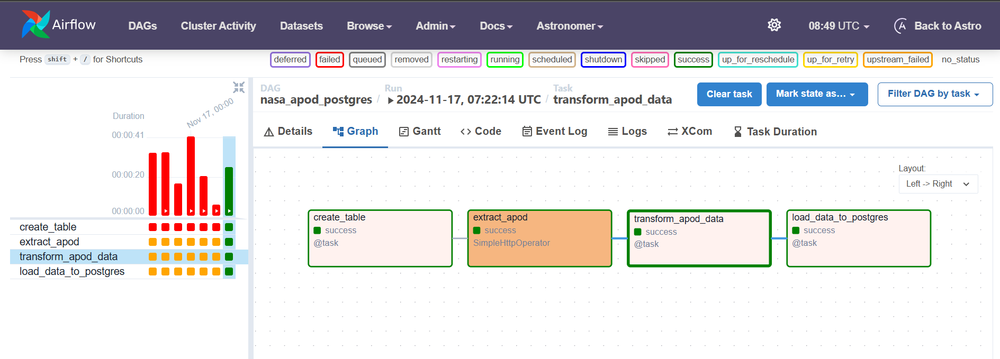
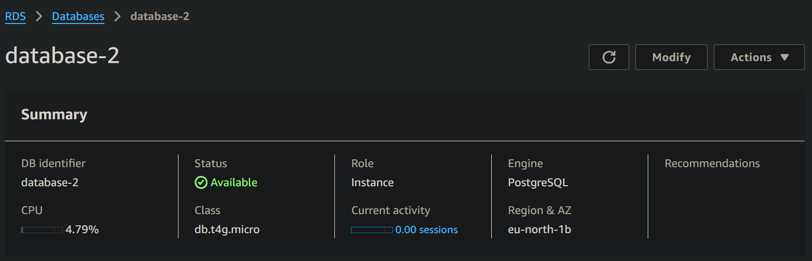

# Airflow NASA APOD ETL Pipeline

## Project Overview

This project implements an ETL (Extract, Transform, Load) pipeline using Apache Airflow to extract daily astronomy data from NASA's Astronomy Picture of the Day (APOD) API and load it into a PostgreSQL database.

## Technologies Used

- Apache Airflow
- PostgreSQL
- Docker
- NASA APOD API

## Project Architecture

### Components

1. **Airflow Orchestration**
   - Manages ETL workflow using Directed Acyclic Graph (DAG)
   - Schedules and monitors data pipeline tasks

2. **PostgreSQL Database**
   - Stores extracted and transformed astronomy data
   - Hosted in Docker container
   - Ensures data persistence

3. **NASA APOD API**
   - Provides daily astronomy picture metadata
   - Source of extracted data

## ETL Workflow

### 1. Extract
- Uses Airflow's SimpleHttpOperator
- Retrieves JSON data from NASA APOD API
- Captures metadata including title, explanation, image URL

### 2. Transform
- Processes JSON data using Airflow TaskFlow API
- Extracts and formats relevant fields
- Prepares data for database insertion

### 3. Load
- Utilizes PostgresHook to load transformed data
- Automatically creates target table if not exists
- Inserts daily astronomy data into PostgreSQL

## Project Screenshots

*Airflow DAG Workflow*

*AWS RDS Postgres Database*

## Prerequisites

- Docker
- Docker Compose
- NASA API Key
- Python 3.8+
- Airflow
- PostgreSQL

## Setup and Installation

1. Clone the repository
2. Configure NASA API key
3. Set up Docker containers
4. Initialize Airflow
5. Trigger DAG

## Environment Configuration

- Docker Compose for service orchestration
- Environment variables for API and database credentials
- Volume mapping for data persistence

## Future Improvements

- Add error handling
- Implement data validation
- Create visualization dashboards
- Extend to multiple API sources

## Licensing

[Add your license information]

## Contact

[Add contact information]
